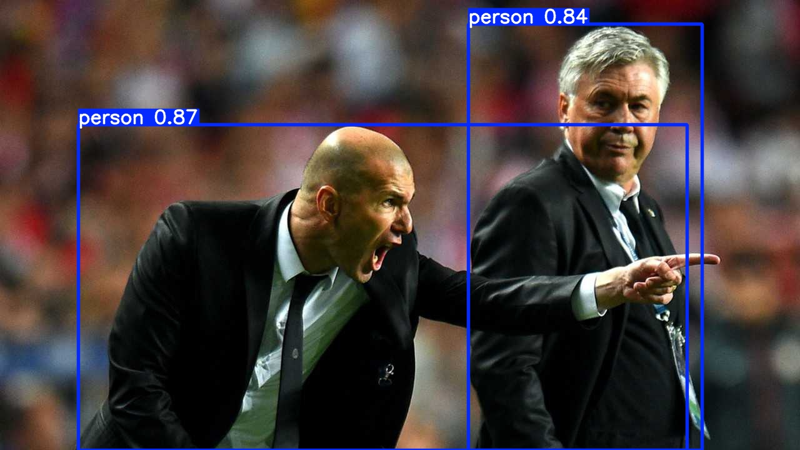

## Installation
1. Install [ultralytics](https://docs.ultralytics.com/quickstart/)
## Generate a new model
Use yolo-world to generate a new small model to detect just person and bus class. 
Run
```bash
python3 yolo_world.py
```
## Run a new model
Use a new to perform inference
``` bash
python3 yolo_model_person_bus.py
```

## Output Results
1. Bus and Person Image

2. Person Image

3. Dogs Image


